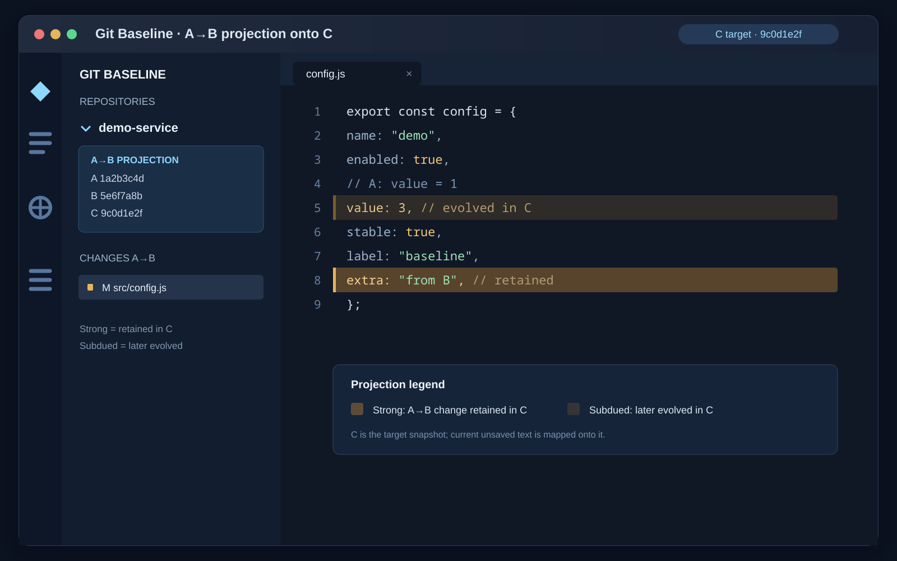

# Git Baseline：Git 固定基线标记

[English](README.md)

<p align="center"></p>

这个 VS Code 扩展可以固定 Git 基线查看累计改动，也可以把 A→B 的变更投影到较晚的 C 状态，同时保留原有 Git“更改”区。

## 安装与首次使用

1. 首次发布到市场后，在 VS Code 扩展视图搜索 `Storehouseconsciousness.git-baseline-marker` 并安装。
2. 在首次发布前，可从[最新发布页面](https://github.com/Hash012/git-baseline-highlights/releases/latest)下载 `.vsix`，执行 **Extensions: Install from VSIX…（扩展: 从 VSIX 安装…）**。
3. 安装后重新加载窗口，打开一个可信的 Git 工作区。
4. 执行 **Git 固定基线标记：选择基线**（英文界面为 **Git Baseline: Select Baseline**），输入提交哈希、标签或分支名。

- 输入会解析为完整提交哈希，并按仓库保存。通过命令选择的基线固定不动，之后分支前进也不会改变它。
- 首次使用不会擅自选择某个基线；选择完成后才开始标记。
- 多个仓库打开时，每个发现的仓库独立保存基线；可见编辑器会按所属仓库分别绘制，状态栏跟随当前编辑器。

## 颜色与操作

| 显示 | 含义 |
| --- | --- |
| 淡绿色行背景 | 新增文件或纯插入行。 |
| 淡橙色行背景 | 修改文件或替换块中的现存行。 |
| 淡红色行背景 | 删除发生的位置，已删除的文本不会重新插入。 |
| 更淡的投影色 | A→B 的变更在 C 中已被后续修改，但仍可映射到对应内容。 |

| 命令 | 用途 |
| --- | --- |
| Git 固定基线标记：选择基线 | 为当前仓库选择新的固定基线。 |
| Git 固定基线标记：选择 A→B 到 C 的投影 | 选择 A、B、C，并把 A→B 的变更投影到 C。 |
| Git 固定基线标记：开关标记 | 开关标记。 |
| Git 固定基线标记：刷新标记 | 手动重新计算差异。 |
| Git 固定基线标记：查看图例 | 查看图例及范围。 |
| Git 固定基线标记：为所有仓库设置基线 | 在工作区发现的所有 Git 仓库中设置同一个固定基线。 |

状态栏显示基线，悬停标记可以查看说明。未保存的文本会在停止输入片刻后更新；保存、文件操作、重新聚焦窗口和 Git 元数据变化也会刷新。

扩展侧栏会列出工作区发现的 Git 仓库及其变更文件。打开 **Git 固定基线标记** 视图可为单个仓库选择基线，也可以使用标题栏命令一次为所有仓库设置基线。默认扫描工作区根目录下三层以内的嵌套仓库，可通过 `gitBaselineHighlights.scanDepth` 调整。

## 与 Git 标记长期共存

默认只绘制淡色行背景：基线累计变化看背景，Git 未提交变化看原有侧边标记与文件状态。扩展默认不占用行号旁图标、右侧概览栏或文件树徽标。

例如，基线之后新增并已提交的行仍显示绿色背景，但没有 Git 未提交标记；再次修改该行时，Git 侧边标记会与绿色背景一起显示。悬停背景可确认基线含义。删除用相邻现存行的红色背景定位，空文件没有可绘制的行。

以下可选设置默认为 `false`，开启后相应位置可能与 Git 或其他扩展重叠：

- `gitBaselineHighlights.showGutterIcons`：显示行号旁彩色菱形。
- `gitBaselineHighlights.showOverviewRuler`：显示右侧概览栏标记。
- `gitBaselineHighlights.showFileBadges`：显示文件树 A/M/D/R 徽标和变更目录标记。

修改设置后自动更新，无需重启。建议保持默认共存布局，仅在需要时开启额外标记。

## 将 A→B 的变更投影到 C

执行 **Git 固定基线标记：选择 A→B 到 C 的投影**，依次输入三个提交。A 是变更起点，B 是变更终点，C 是目标状态；B 必须是 C 的祖先，A 也必须是 B 的祖先。扩展不会切换分支，而是读取 C 的快照并把投影标记映射到当前编辑器内容。

- A→B 的变更在 C 中原样保留：使用正常的强颜色。
- A→B 的变更在 C 中被继续修改：使用更淡的弱颜色。
- 变更在 C 中被回退、删除或无法映射：不标记。

也可以在设置中同时配置 `gitBaselineHighlights.projectionStart`、`gitBaselineHighlights.projectionEnd` 和 `gitBaselineHighlights.projectionTarget`。三项全部填写后会启用投影；全部留空则继续使用普通单基线模式。



示例中，A→B 且被 C 原样保留的行使用强背景；被 C 后续演进的行使用较淡背景。

## 配置与迁移

通常不需要配置。如需指定目标，在 VS Code **用户设置**中配置，避免将设置文件写入项目：

- `gitBaselineHighlights.repository`：目标仓库目录；默认留空，自动识别。
- `gitBaselineHighlights.base`：显式基线；默认留空，使用各仓库通过命令保存的选择。
- `gitBaselineHighlights.projectionStart`：投影起点 A；需与下面两个投影设置一起填写。
- `gitBaselineHighlights.projectionEnd`：投影终点 B。
- `gitBaselineHighlights.projectionTarget`：投影目标 C，必须等于或晚于 B。
- `gitBaselineHighlights.comparisonMode`：`direct` 直接比较所选提交；`mergeBase` 比较所选引用与 `HEAD` 的共同祖先，适合 PR 风格审查。
- `gitBaselineHighlights.followBase`：配置的基线是分支或标签时，每次刷新重新解析；默认关闭以保持固定提交语义。
- `gitBaselineHighlights.scanDepth`：嵌套 Git 仓库探测深度，默认 3。

配置表达式改变时默认解析并保存一次，之后刷新不会跟随分支移动。开启 `followBase` 后会在刷新时重新解析。随后通过命令选择的新基线会替换保存的选择，不改设置；再次改变配置表达式则重新解析。

扩展的 Marketplace 标识为 `Storehouseconsciousness.git-baseline-marker`。迁移时也可以在新的 VS Code 环境搜索该标识；首次发布前仍可安装 VSIX。本仓库公开源代码和安装包。

## 对 Git 的影响与范围

- 只读 Git，绘制编辑器装饰；不改代码、不切分支、不暂存、不提交、不改 Git 配置或工作区设置。
- 基线选择与开关保存在 VS Code 扩展工作区存储中。
- 工作区内发现的每个仓库独立保存基线；仓库扫描深度可配置。
- 被忽略的文件不因打开而标为新增；已跟踪文件仍可比较。
- 二进制、单侧超过 2 MiB、超过十万行的文件跳过行标记。
- 混合替换块整体标橙，不提供逐字符的新增归属判断。
- 重命名会显示为 R 徽标；旧路径仍作为删除状态参与变更列表。
- 特殊编码或换行转换可能表现为整块替换。开启可选文件树徽标后，也可能受其他装饰提供者影响。
- 临时对比文本在系统临时目录中创建，完成后删除；进程被强制结束可能留下临时目录。
- 需要 Git 和 VS Code 1.85 及以上版本。当前 Linux 环境已实测；持续集成配置覆盖 Linux、macOS 和 Windows，结果以实际运行记录为准。

## 开发与打包

运行时无 npm 依赖。开发建议 Node.js 22 及以上，打包使用官方 `@vscode/vsce` CLI。

```bash
npm test
npm run package
```

如果 npm registry 不可用，可运行 `npm run package:offline`，使用仓库内置的 Python 标准库打包器生成发布包。

如果 Marketplace 报错 `An extension that was made public can't be changed to private`，请丢弃旧的离线 VSIX 并重新打包。当前离线打包器会在 `extension.vsixmanifest` 中写入 `<GalleryFlags>Public</GalleryFlags>`；上传前可运行 `unzip -p dist/git-baseline-marker-0.4.1.vsix extension.vsixmanifest | grep GalleryFlags` 验证。

本地使用 Azure 身份发布时，先通过 Azure CLI 登录，再运行 `npm run publish:azure`。推荐的发布方式是推送匹配的 `v*.*.*` 标签：GitHub Actions 通过 GitHub OIDC 登录 Microsoft Entra，然后执行 `npx @vscode/vsce publish --no-dependencies --no-yarn --azure-credential`。首次推送标签前，需要创建并保护 `marketplace` 环境，配置 `AZURE_CLIENT_ID`、`AZURE_TENANT_ID` 和 `AZURE_SUBSCRIPTION_ID` 三个环境密钥，并将该 Entra 应用或托管身份加入 `Storehouseconsciousness` Marketplace 发布者并授予 Contributor 权限。

`vsce package` 默认把 `<name>-<version>.vsix` 输出到项目根目录；本次版本可使用 `npx --yes @vscode/vsce package --no-dependencies --no-yarn --out dist/git-baseline-marker-0.4.1.vsix` 输出到 `dist/`。测试只在系统临时目录建立独立仓库，不改变被标记的项目。

代码采用 [MIT 许可证](LICENSE)，欢迎通过 Issue 和 Pull Request 反馈与贡献。
